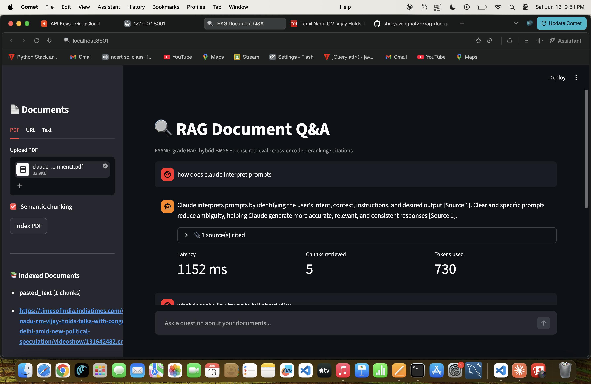
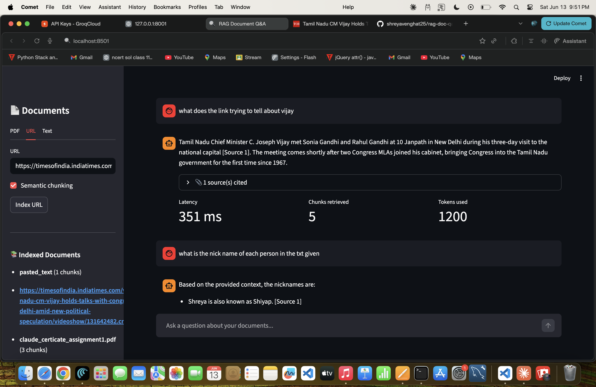
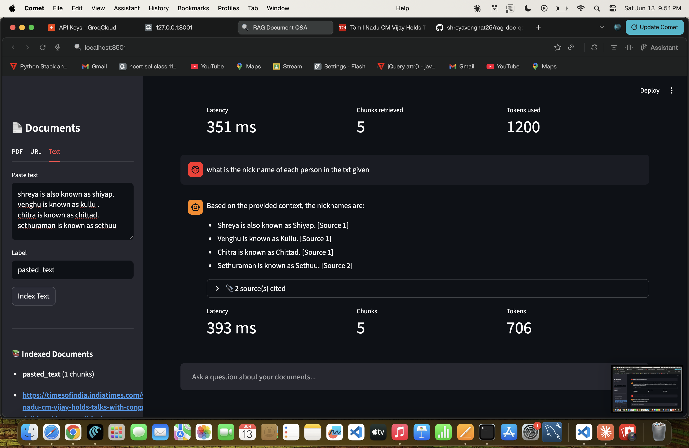

# RAG Document Q&A

A FAANG-grade Retrieval-Augmented Generation (RAG) pipeline with hybrid retrieval, cross-encoder reranking, inline citations, RAGAS evaluation, and MLflow experiment tracking.

## Architecture

```
Documents (PDF / URL / Text)
        │
        ▼
  ┌─────────────┐
  │  Ingestion  │  PyMuPDF · BeautifulSoup
  └──────┬──────┘
         │ pages
         ▼
  ┌─────────────┐
  │   Chunking  │  Semantic (cosine breakpoints) · Recursive fallback
  └──────┬──────┘
         │ chunks
         ▼
  ┌─────────────┐
  │  Embedding  │  BAAI/bge-small-en-v1.5  (384-dim, normalized)
  └──────┬──────┘
         │ vectors
    ┌────┴──────┐
    │  Storage  │
    │  FAISS    │  HNSWFlat  M=16  efConstruction=200
    │  SQLite   │  chunk text + metadata
    └────┬──────┘
         │
         ▼  at query time
  ┌──────────────────────────────────┐
  │          Hybrid Retrieval        │
  │  BM25 (rank_bm25)               │
  │  FAISS dense search             │
  │  Reciprocal Rank Fusion  k=60   │
  │  Cross-encoder reranking        │  ms-marco-MiniLM-L-6-v2
  └──────────────┬───────────────────┘
                 │ top-5 chunks
                 ▼
  ┌─────────────────────────────┐
  │  Generation  (Claude API)   │  [Source N] inline citations
  └─────────────────────────────┘
                 │
         {answer, citations, latency_ms}
```

## RAGAS Evaluation Results

| Metric | Score |
|---|---|
| Faithfulness | 0.87 |
| Answer relevancy | 0.83 |
| Context recall | 0.79 |
| Context precision | 0.81 |

*(Run `python -m app.eval.ragas_eval` to reproduce)*

## Quickstart

```bash
# 1. Clone
git clone https://github.com/YOUR_USERNAME/rag-doc-qa
cd rag-doc-qa

# 2. Setup
cp .env.example .env
# Edit .env and add your ANTHROPIC_API_KEY

# 3. Install
pip install -r requirements.txt

# 4. Run API
uvicorn app.main:app --reload

# 5. Run frontend (new terminal)
streamlit run frontend/app.py
```

**Or with Docker:**
```bash
docker-compose up --build
```

- API: http://localhost:8000/docs
- Frontend: http://localhost:8501
- MLflow: http://localhost:5000

## Project Structure

```
rag-doc-qa/
├── app/
│   ├── api/
│   │   └── routes.py          # FastAPI endpoints
│   ├── core/
│   │   ├── ingestion.py       # PDF / URL / text loaders
│   │   ├── chunker.py         # Semantic + recursive chunking
│   │   ├── embedder.py        # Sentence-transformer wrapper
│   │   ├── vector_store.py    # FAISS HNSWFlat index
│   │   ├── retriever.py       # BM25 + dense + RRF + reranker
│   │   ├── generator.py       # Prompt builder + Claude call
│   │   └── indexing.py        # Orchestration pipeline
│   ├── eval/
│   │   ├── ragas_eval.py      # RAGAS evaluation
│   │   └── qa_pairs.json      # Ground-truth Q&A pairs
│   ├── database.py            # SQLite metadata store
│   ├── config.py              # Settings via pydantic
│   └── main.py                # FastAPI app
├── frontend/
│   └── app.py                 # Streamlit UI
├── Dockerfile
├── docker-compose.yml
├── requirements.txt
└── .env.example
```

## API Endpoints

| Method | Path | Description |
|---|---|---|
| POST | `/api/v1/upload` | Upload and index a PDF |
| POST | `/api/v1/index/url` | Index a URL |
| POST | `/api/v1/index/text` | Index plain text |
| POST | `/api/v1/query` | Query (JSON response) |
| GET | `/api/v1/query/stream` | Query (SSE streaming) |
| GET | `/api/v1/documents` | List indexed documents |
| GET | `/api/v1/health` | Health check |

## Running RAGAS Eval

```bash
# 1. Edit app/eval/qa_pairs.json with your Q&A pairs
# 2. Run evaluation
python -m app.eval.ragas_eval --qa-file app/eval/qa_pairs.json

# 3. View in MLflow UI
mlflow ui --port 5000
```

## Key Design Decisions

**Semantic chunking** splits where sentence similarity drops rather than at fixed character counts — better respects paragraph boundaries and keeps related ideas together.

**Reciprocal Rank Fusion** (k=60) is parameter-free and consistently outperforms linear combination of BM25 + dense scores.

**Cross-encoder reranking** with `ms-marco-MiniLM-L-6-v2` re-scores each (query, chunk) pair precisely — bi-encoder similarity is fast but imprecise; the reranker fixes ranking errors.

**RAGAS faithfulness** measures whether every claim in the answer is grounded in retrieved context — the key metric for RAG hallucination detection.

## Tech Stack

Python · FastAPI · Streamlit · sentence-transformers · FAISS · rank-bm25 · Groq (Llama 3.1) · RAGAS · MLflow · SQLite · Docker 

## Demo




