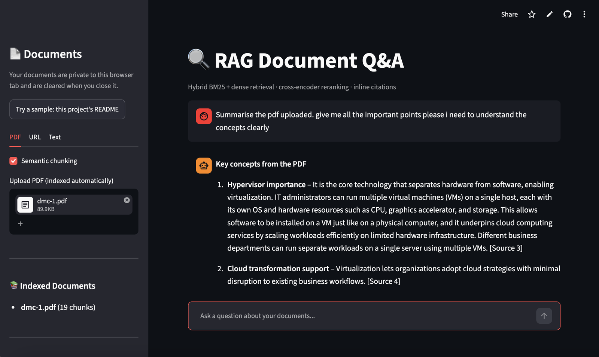
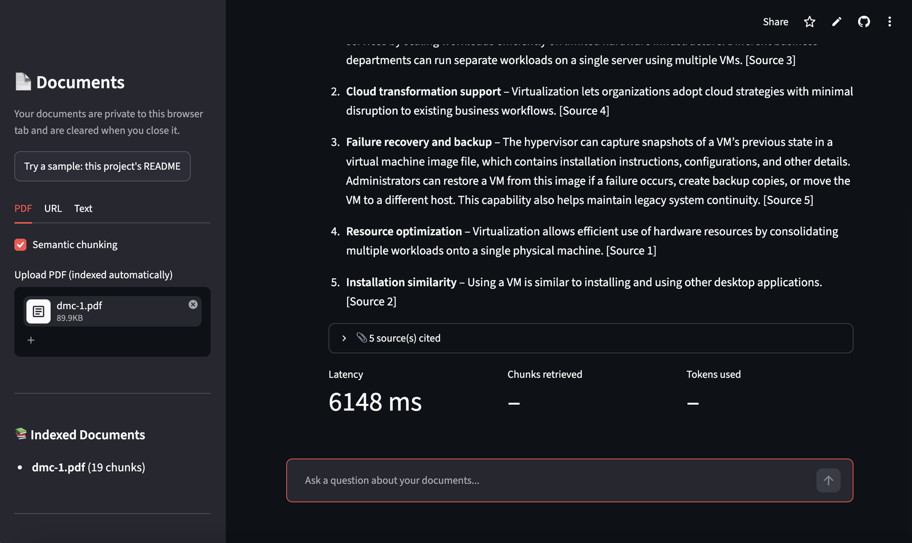

# RAG Document Q&A

Ask questions about your own PDFs, web pages, or text and get answers grounded in the source, with inline citations back to the exact file and page.

The retrieval pipeline combines lexical (BM25) and semantic (dense vector) search, fuses them with Reciprocal Rank Fusion, and reranks the candidates with a cross-encoder before the LLM writes an answer. Answers stream token by token over Server-Sent Events.

**Live demo: [shreya-rag-docs.streamlit.app](https://shreya-rag-docs.streamlit.app)** — click "Try a sample" in the sidebar to ask questions about this README, or upload your own PDF.

## Architecture

```
Documents (PDF / URL / Text)
        │
        ▼
  ┌─────────────┐
  │  Ingestion  │  PyMuPDF · BeautifulSoup
  └──────┬──────┘
         │ pages
         ▼
  ┌─────────────┐
  │   Chunking  │  Semantic (cosine-similarity breakpoints) · recursive fallback
  └──────┬──────┘
         │ chunks
         ▼
  ┌─────────────┐
  │  Embedding  │  BAAI/bge-small-en-v1.5  (384-dim, normalized, runs locally)
  └──────┬──────┘
         │ vectors
    ┌────┴──────┐
    │  Storage  │
    │  FAISS    │  HNSWFlat  M=16  efConstruction=200
    │  SQLite   │  chunk text + metadata
    └────┬──────┘
         │
         ▼  at query time
  ┌──────────────────────────────────┐
  │          Hybrid Retrieval        │
  │  BM25 (rank_bm25)                │
  │  FAISS dense search              │
  │  Reciprocal Rank Fusion  k=60    │
  │  Cross-encoder reranking         │  ms-marco-MiniLM-L-6-v2
  └──────────────┬───────────────────┘
                 │ top-5 chunks
                 ▼
  ┌─────────────────────────────────┐
  │  Generation  (Groq, gpt-oss-20b)│  [Source N] inline citations
  └─────────────────────────────────┘
                 │
     {answer, citations, latency_ms}   (JSON or SSE stream)
```

## Quickstart

Requires Python 3.11 and a free Groq API key from [console.groq.com/keys](https://console.groq.com/keys).

```bash
git clone https://github.com/shreyavenghat25/rag-doc-qa
cd rag-doc-qa

cp .env.example .env          # then set GROQ_API_KEY in .env
pip install -r requirements.txt

uvicorn app.main:app --port 8000        # API  → http://localhost:8000/docs
streamlit run frontend/app.py           # UI   → http://localhost:8501  (second terminal)
```

Self-contained mode (no API server; the UI runs the pipeline in-process, as the hosted demo does):

```bash
RAG_MODE=embedded streamlit run frontend/app.py
```

Or with Docker:

```bash
docker compose up --build
```

API at http://localhost:8000/docs, UI at http://localhost:8501, MLflow at http://localhost:5000.

## API Endpoints

| Method | Path                   | Description                |
| ------ | ---------------------- | -------------------------- |
| POST   | `/api/v1/upload`       | Upload and index a PDF     |
| POST   | `/api/v1/index/url`    | Index a web page           |
| POST   | `/api/v1/index/text`   | Index plain text           |
| POST   | `/api/v1/query`        | Ask a question (JSON)      |
| GET    | `/api/v1/query/stream` | Ask a question (SSE stream)|
| GET    | `/api/v1/documents`    | List indexed documents     |
| GET    | `/api/v1/health`       | Health check               |

## Key Design Decisions

**Hybrid retrieval.** BM25 catches exact terms (names, codes, acronyms) that embeddings blur; dense search catches paraphrases that share no words with the query. Running both covers each one's blind spot.

**Reciprocal Rank Fusion (k=60).** BM25 scores and cosine similarities live on different scales, so adding them requires tuning weights. RRF combines the two rankings by position only, which needs no score normalization.

**Cross-encoder reranking.** The bi-encoder embeds query and chunk separately, which is fast but approximate. The cross-encoder reads each (query, chunk) pair together and scores relevance more precisely, so it is applied only to the ~20 fused candidates.

**Semantic chunking.** Chunks are split where the cosine similarity between consecutive sentences drops, so related sentences stay together instead of being cut at a fixed character count.

**Non-blocking streaming.** The SSE endpoint runs retrieval and the blocking LLM stream in a worker thread, so one long answer does not stall other requests on the event loop.

**Two deployment modes, one pipeline.** The Streamlit UI talks to a backend interface with two implementations: an HTTP client for the FastAPI service (local and Docker), and an embedded mode that calls the same pipeline in-process (the hosted demo, where only one process is available). Retrieval, reranking, and generation code is identical in both.

**Per-visitor isolation in the demo.** The API keeps one persistent index. A public demo can't, or every visitor would search everyone else's uploads. In embedded mode each browser session gets a private in-memory FAISS index and chunk store, while the embedding model and reranker are loaded once and shared. Re-uploading the same file is detected by content hash and skipped, and sessions are capped at 5 documents to keep memory bounded on a free host.

**Citation mapping.** The model is prompted to cite `[Source N]`; the server parses those markers (tolerating `[N]` and `[Source 1, 3]` variants) and maps them back to the retrieved chunk, file, and page.

## Evaluation

Retrieval is benchmarked on [BEIR SciFact](https://github.com/beir-cellar/beir): 5,183 scientific abstracts and 300 test queries with expert relevance labels. All four configurations run on the same index with 20 candidates per query.

| Configuration | nDCG@10 | MRR@10 | Recall@5 | Recall@10 | Recall@20 | Latency / query |
|---|---|---|---|---|---|---|
| BM25 only | 0.560 | 0.524 | 0.616 | 0.686 | 0.737 | 8 ms |
| Dense only (bge-small) | **0.717** | **0.681** | **0.762** | **0.842** | 0.875 | 18 ms |
| Hybrid (RRF) | 0.679 | 0.640 | 0.734 | 0.823 | **0.882** | 21 ms |
| Hybrid + cross-encoder rerank | 0.700 | 0.666 | 0.746 | 0.832 | **0.882** | 301 ms |

*Measured on a MacBook Air (CPU). Reproduce with `python -m app.eval.retrieval_eval`; runs are also logged to MLflow.*

**What the numbers show**

- Dense retrieval alone is the strongest configuration on this dataset.
- BM25 scores 0.560 nDCG@10, about 0.1 below the published BEIR BM25 baseline (0.665). The tokenizer here is a plain whitespace split with no stemming or stop-word removal, which is the likely cause.
- Hybrid fusion finds the most relevant documents overall (best Recall@20) but ranks them worse than dense alone: equal-weight RRF lets the weaker BM25 ranking pull good dense results down.
- Cross-encoder reranking recovers part of that gap (0.679 → 0.700) at roughly 280 ms extra per query. The reranker (ms-marco-MiniLM) was trained on web search, not scientific text.

**Next experiments:** proper BM25 tokenization, weighted fusion, and reranking dense candidates directly, each measured with the same benchmark.

`app/eval/ragas_eval.py` is a separate harness for end-to-end answer quality (faithfulness, relevancy) with RAGAS; it needs a question/answer set for your own documents.

## Project Structure

```
rag-doc-qa/
├── app/
│   ├── api/routes.py          # FastAPI endpoints (JSON + SSE)
│   ├── core/
│   │   ├── ingestion.py       # PDF / URL / text loaders
│   │   ├── chunker.py         # Semantic + recursive chunking
│   │   ├── embedder.py        # Sentence-transformer wrapper
│   │   ├── vector_store.py    # FAISS HNSWFlat index
│   │   ├── retriever.py       # BM25 + dense + RRF + reranker
│   │   ├── generator.py       # Prompt, Groq call, citation parsing
│   │   └── indexing.py        # Ingestion orchestration
│   ├── eval/retrieval_eval.py # BEIR retrieval benchmark (nDCG, MRR, Recall)
│   ├── eval/ragas_eval.py     # RAGAS answer-quality harness
│   ├── database.py            # SQLite metadata store
│   ├── config.py              # Settings via pydantic-settings
│   └── main.py                # FastAPI app
├── app/core/session.py        # Per-visitor in-memory index (demo mode)
├── frontend/
│   ├── app.py                 # Streamlit UI
│   ├── backends.py            # API client / embedded backend
│   └── requirements.txt       # Lean CPU-only deps for the hosted demo
├── Dockerfile
├── docker-compose.yml
└── requirements.txt
```

## Tech Stack

Python · FastAPI · Streamlit · sentence-transformers · FAISS · rank-bm25 · Groq (gpt-oss-20b) · RAGAS · MLflow · SQLite · Docker

## Demo

Uploading a PDF and asking for a summary on the [live demo](https://shreya-rag-docs.streamlit.app). Each point cites the chunk it came from:




